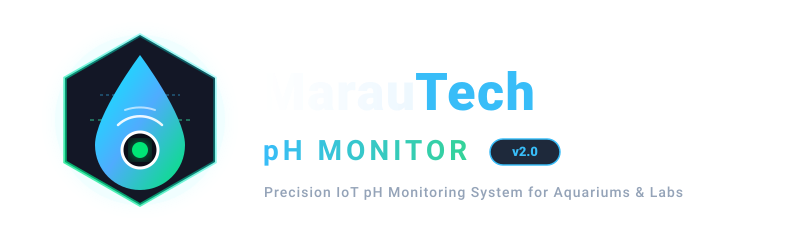
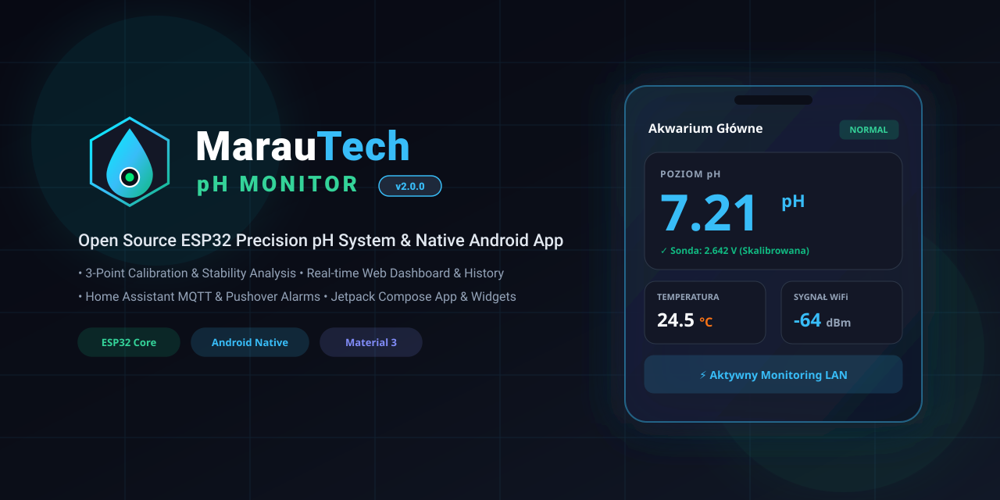

<div align="center">

# MarauTech pH Monitor

<p align="center">
  
</p>

**Precision Open Source ESP32 pH Monitoring System with Native Android App & Home Assistant Integration**

[](https://github.com/MarauTech/DIY-PH-MONITOR-/releases/latest)
[](https://www.espressif.com/)
[](https://developer.android.com/jetpack/compose)
[](LICENSE)
[](https://marautech.github.io/DIY-PH-MONITOR-/)

[**Website**](https://marautech.github.io/DIY-PH-MONITOR-/) • [**Release Notes**](RELEASE_NOTES_v2.0.0.md) • [**Changelog**](CHANGELOG.md) • [**Downloads**](#-downloads) • [**Android App**](#-android-application) • [**Hardware & Pinout**](#-hardware--wiring) • [**REST API**](#-rest-api-overview)

---

</div>

## 📌 Project Overview

**MarauTech pH Monitor** is an industrial-grade, open source smart monitoring system designed for continuous water quality analysis in freshwater/marine aquariums, hydroponics, and laboratory systems. 

Unlike commercial cloud-locked monitors, MarauTech pH Monitor operates **100% locally over your Wi-Fi LAN** with zero subscriptions and zero external dependencies. It combines a calibrated ESP32 firmware running an asynchronous Web dashboard with a dedicated native **Material 3 Android Application**, home screen widgets, and **Home Assistant MQTT** auto-discovery.

---

## 📦 Downloads

| Artifact | Version | Description | Download Link |
| :--- | :--- | :--- | :--- |
| **Android APK** | `v2.0.0` | Native Jetpack Compose App + Widgets | [**Download APK**](https://github.com/MarauTech/DIY-PH-MONITOR-/releases/latest/download/MarauTech-pH-Monitor-v2.0.0.apk) |
| **ESP32 Firmware** | `v2.0.0` | Full single-binary firmware (`firmware.bin`) | [**Download Firmware**](https://github.com/MarauTech/DIY-PH-MONITOR-/releases/latest/download/MarauTech-pH-Monitor-v2.0.0-firmware.bin) |
| **LittleFS Filesystem** | `v2.0.0` | Flash filesystem for history log storage | [**Download Filesystem**](https://github.com/MarauTech/DIY-PH-MONITOR-/releases/latest/download/MarauTech-pH-Monitor-v2.0.0-filesystem.bin) |

---

## ✨ Key Features

- **🎯 3-Point pH Calibration Engine**: Calibrate using standard buffers (`pH 4.01`, `pH 7.00`, `pH 9.18`) or custom buffer solutions with real-time standard deviation stability analysis.
- **⚡ Single-Bin Embedded Web Dashboard**: Modern responsive web SPA embedded directly into flash PROGMEM with real-time live data polling, history graphs, and zero LittleFS dependency for web assets.
- **📱 Native Android Mobile App**: Built with Kotlin and Jetpack Compose featuring Hero Dashboard, custom Canvas graphs, background WorkManager alerts, and 3 Home Screen Widgets.
- **🔔 Spam-Free Background Notifications**: System alerts on state transitions (`NORMAL` ➔ `LOW`/`HIGH` pH) and recovery alerts without polling spam.
- **🏡 Home Assistant MQTT Integration**: Auto-discovery with live entity states, diagnostic sensors, and alarm states.
- **📨 Pushover Mobile Alerts**: Direct emergency mobile push notifications when water parameters breach configured thresholds.
- **📊 24-Hour LittleFS History Logger**: Round-robin historical data logging stored locally on SPIFFS/LittleFS flash.
- **🔒 Secure Authentication**: Protected admin configuration endpoints using HTTP Basic Auth and credentials encrypted via Android Keystore.

---

## 📱 Android Application

The dedicated Android application is located in the [`PhMonitorApp/`](PhMonitorApp/) directory.

<div align="center">
  
</div>

### Highlights:
1. **Hero Dashboard**: Instant visibility into pH, probe voltage, DS18B20 temperature, and animated status badges (`NORMAL`, `LOW pH`, `HIGH pH`, `OFFLINE`).
2. **3 Home Screen Widgets**:
   - **Compact (1x1 / 2x1)**: Real-time pH and status badge.
   - **Medium (2x2 / 3x2)**: pH, temperature, status, device name, and refresh button.
   - **Large (4x2 / 4x3)**: Full telemetry including voltage, uptime, and quick launcher.
3. **Interactive History**: High-performance custom Canvas line chart supporting pH, temperature, and voltage with 1h to 24h range filtering.
4. **Step-by-Step Calibration Assistant**: Live countdown and stability progress feedback directly from the ESP32 calibration engine.

---

## 🔌 Hardware & Wiring

### Bill of Materials (BOM):
- **ESP32 DevKit V1** (30-pin or 38-pin ESP-WROOM-32)
- **Analog pH Sensor Module** (pH-4502C or industrial BNC transmitter board)
- **DS18B20 Temperature Sensor** (Waterproof probe + 4.7kΩ pull-up resistor)
- **ST7789 2.0" / 2.4" TFT Display** (320x240 SPI)
- **Active 5V/3.3V Buzzer** (Audible threshold alarm)
- **Rotary Encoder with Push Button** (Physical menu control)

### Pinout Mapping:

| Module | Pin Name | ESP32 GPIO | Description |
| :--- | :--- | :--- | :--- |
| **pH Sensor** | `AOUT` / `PO` | **GPIO 35** | Analog pH probe voltage input (ADC1_CH7) |
| **Temperature** | `DATA` | **GPIO 23** | Dallas 1-Wire bus with 4.7kΩ pull-up to 3.3V |
| **Buzzer** | `VCC / SIG` | **GPIO 22** | High-level active buzzer driver |
| **TFT Display** | `MOSI / SDA` | **GPIO 18** | SPI Master Output Slave Input |
| **TFT Display** | `SCLK / SCK` | **GPIO 19** | SPI Clock |
| **TFT Display** | `CS` | **GPIO 5** | SPI Chip Select |
| **TFT Display** | `DC` | **GPIO 16** | Data / Command Select |
| **TFT Display** | `RST` | **GPIO 4** | Display Hardware Reset |
| **Encoder** | `CLK` | **GPIO 32** | Quadrature Clock A |
| **Encoder** | `DT` | **GPIO 33** | Quadrature Data B |
| **Encoder** | `SW` | **GPIO 25** | Push-button switch |

---

## 💻 Installation & Flashing

### Building and Flashing Firmware via PlatformIO:
```bash
# 1. Clone the repository
git clone https://github.com/MarauTech/DIY-PH-MONITOR-.git
cd DIY-PH-MONITOR-

# 2. Build and upload firmware over USB
pio run -t upload

# 3. Build and upload LittleFS filesystem
pio run -t buildfs
pio run -t uploadfs
```

### Building the Android App APK:
```bash
cd PhMonitorApp
./gradlew assembleRelease
# Output APK: app/build/outputs/apk/release/app-release.apk
```

---

## 🌐 REST API Overview

All API endpoints communicate directly with the ESP32 over HTTP LAN (`http://<ESP32_IP>/`):

| Endpoint | Method | Auth | Description |
| :--- | :--- | :--- | :--- |
| `/api/status` | `GET` | Public | Real-time sensor readings, alarms, uptime, and Wi-Fi RSSI |
| `/api/history` | `GET` | Public | Historical JSONL records array (`?limit=1440`) |
| `/api/config` | `GET` | Basic Auth | Current alarm thresholds, MQTT, and Pushover status |
| `/api/config` | `POST` | Basic Auth | Update alarm thresholds, device name, and MQTT settings |
| `/api/calibrate` | `POST` | Basic Auth | Trigger calibration (`neutral`, `acid`, `base`, `custom`, `reset`) |
| `/api/calibrate/status` | `GET` | Public | Poll calibration state, progress percentage, and error codes |
| `/api/pushover/test` | `POST` | Basic Auth | Send test push notification |
| `/api/reset-stats` | `POST` | Basic Auth | Reset Min/Max pH and temperature statistics |

---

## 🗂️ Project Structure

```
DIY-PH-MONITOR-/
├── assets/                  # Branding, logos, and screenshots
│   └── branding/            # SVG logos, dark/light variants, marks, banners
├── docs/                    # GitHub Pages project website (v2.0)
│   ├── index.html           # Landing page
│   ├── styles.css           # Styling & animations
│   ├── script.js            # Smooth scroll & interactivity
│   └── assets/              # Web assets & favicons
├── PhMonitorApp/            # Native Android Application (Jetpack Compose)
│   ├── app/src/main/        # Kotlin source, Compose UI, App Widgets, Workers
│   └── build.gradle.kts     # Gradle build script (versionName = "2.0.0")
├── include/                 # Firmware header files (defaults.h, config.h)
├── src/                     # Firmware C++ implementation
│   ├── data/                # History logger & LittleFS storage
│   ├── display/             # ST7789 TFT display UI & graphs
│   ├── network/             # AsyncWebServer, MQTT, Pushover, OTA
│   └── sensors/             # ADC sampling & 3-point calibration engine
├── platformio.ini           # PlatformIO project configuration
├── CHANGELOG.md             # Version history
├── RELEASE_NOTES_v2.0.0.md  # Official release notes
└── LICENSE                  # MIT License
```

---

## 📄 License & Credits

This project is licensed under the **MIT License** — see the [LICENSE](LICENSE) file for details.

Developed with ❤️ by **[MarauTech](https://github.com/MarauTech)**.
